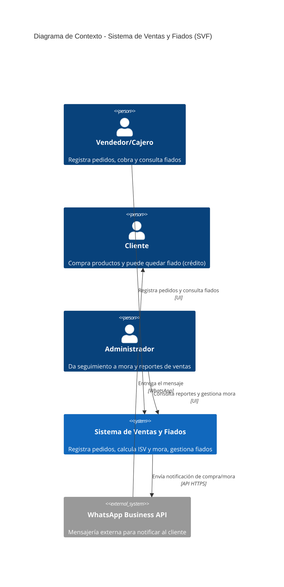
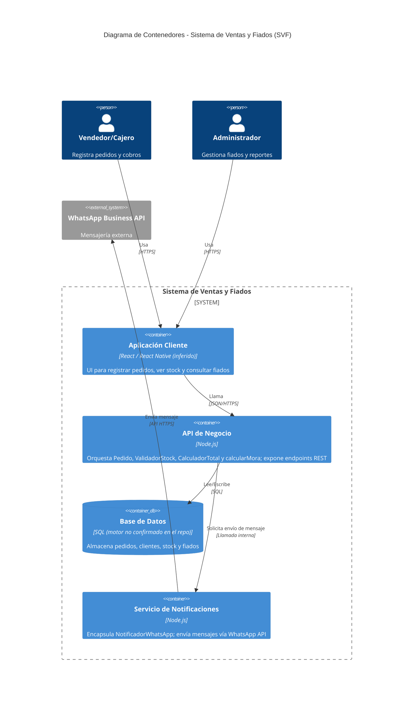

# Práctica 6 · Diagrama C4 de mi sistema

Sistema base: **Sistema de Ventas y Fiados** (evidenciado en `practica-3/despues.md`: clases `Pedido`, `ValidadorStock`, `CalculadorTotal`, `NotificadorWhatsApp`; y en `practica-4/fiados.js`: `calcularMora`).

## Nivel 1 · Diagrama de Contexto

## Nivel 2 · Diagrama de Contenedores

## Justificación de decisiones (atributos de calidad)

1. **Servicio de Notificaciones separado del API de Negocio**: prioricé **mantenibilidad** sobre rendimiento, porque desacoplar `NotificadorWhatsApp` permite cambiar de proveedor de mensajería sin tocar las reglas de negocio (`Pedido`, mora), tal como ya se inyectaba por interfaz en la Práctica 3.
2. **API de Negocio centralizada en un solo backend Node.js** en vez de lógica embebida en la app cliente: prioricé **mantenibilidad y testabilidad** sobre latencia mínima, porque centraliza el cálculo de ISV, stock y mora en un solo lugar y evita duplicar reglas entre plataformas, como lo confirma la suite de pruebas de `fiados.test.js`.

## Nota sobre corrección de alucinaciones de la IA

Generé el borrador con IA y corregí lo siguiente antes de dejarlo:
- La IA asumía inicialmente **MySQL** como motor de base de datos con total certeza; lo cambié a "SQL (motor no confirmado en el repo)" porque el código no especifica ningún motor concreto.
- La IA propuso un contenedor de **microservicio de pagos** que no existe en ningún archivo del repo; lo eliminé por no tener evidencia.
- Marqué "React / React Native" como **inferido** (no confirmado) en vez de afirmarlo como dato duro, ya que solo `practica-1` usa `AsyncStorage` (típico de React Native) pero no hay confirmación explícita del framework en este dominio de ventas/fiados.
