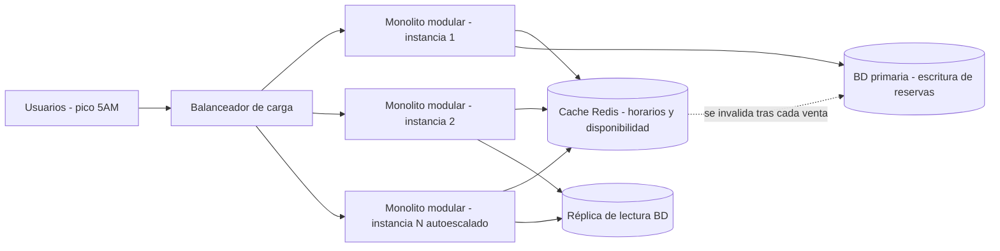

# ADR-001: Estilo arquitectónico para el sistema de venta de boletos de la cooperativa de buses

## Estado
Aceptado

## Contexto

El capstone SE1 es un sistema de venta de boletos para una cooperativa de buses con
~50,000 usuarios, donde el tráfico se concentra en un **pico predecible de venta a las
5 AM** (hora en que la gente compra boletos para la ruta del día). El gerente pidió
"microservicios porque lo leyó en LinkedIn", sin relacionarlo con un problema real del
negocio.

Atributos de calidad priorizados para este caso, en orden:

1. **Consistencia transaccional** — no se puede vender dos veces el mismo asiento
   durante el pico de las 5 AM.
2. **Escalabilidad ante un pico de lectura/escritura concentrado y conocido en el tiempo**
   (no ante crecimiento orgánico constante ni equipos separados).
3. **Simplicidad operativa** — el equipo que construye y mantiene el sistema es pequeño
   (equipo de capstone / startup temprana), sin plataforma de DevOps madura.
4. **Costo** — no se puede pagar infraestructura compleja de forma permanente para un
   pico de ~1 hora al día.

No se prioriza (por ahora): escalar equipos de desarrollo de forma independiente, ni
desplegar partes del sistema con ciclos de release distintos — no existen múltiples
equipos trabajando en paralelo sobre el sistema todavía.

## Opciones consideradas

### Opción A: Monolito modular + caché de lectura

- **Pros para este caso:** consistencia transaccional simple (una sola base de datos,
  una sola transacción para reservar asiento); bajo costo operativo; el equipo pequeño
  puede desplegar y depurar un solo artefacto; el caché resuelve exactamente el
  problema real (lecturas repetidas de horarios/disponibilidad en el pico).
- **Contras para este caso:** no se puede escalar el módulo de ventas de forma
  aislada del resto de la app; un despliegue afecta a todo el sistema.

### Opción B: Microservicios

- **Pros para este caso:** permitiría escalar el servicio de ventas de forma
  independiente del resto; útil si en el futuro hay varios equipos trabajando en
  paralelo.
- **Contras para este caso:** la reserva de asientos sin doble venta se vuelve una
  transacción distribuida (sagas/compensaciones) mucho más compleja que una
  transacción local; exige infraestructura de orquestación, *service discovery* y
  observabilidad distribuida que el equipo actual no tiene ni necesita; el pico es de
  **tráfico**, no de **organización de equipos** — microservicios resuelve un problema
  que este proyecto no tiene, a cambio de una complejidad que sí tendría todos los días.

### Opción C: Serverless (funciones)

- **Pros para este caso:** escalado automático a cero y hacia arriba, atractivo para
  un pico de solo ~1 hora al día; se paga solo por el uso real.
- **Contras para este caso:** los *cold starts* pueden degradar justo el momento más
  crítico (5 AM, alta concurrencia); el bloqueo de asiento (evitar doble venta) es
  más difícil de manejar sin estado persistente entre invocaciones; mayor dificultad
  para depurar y probar localmente con el nivel de experiencia actual del equipo.

## Decisión

Se elige la **Opción A: monolito modular**, con:

- **Caché de lectura (Redis)** delante de la base de datos para horarios y
  disponibilidad de asientos (que se consultan muchas más veces de las que cambian).
- **Balanceador de carga** distribuyendo tráfico entre varias instancias idénticas del
  monolito.
- **Réplicas horizontales del monolito** (autoescalado) activas solo durante la
  ventana del pico (4:30 AM–6:00 AM), y reducidas el resto del día para ahorrar costo.
- **Una única base de datos** para las escrituras de reserva/venta (garantiza la
  consistencia transaccional), con una réplica de solo lectura para aliviar consultas.

Priorizamos consistencia transaccional y simplicidad operativa sobre el desacople
organizacional que ofrecen los microservicios, porque el problema real es un pico de
tráfico en una ventana horaria conocida y no la necesidad de que varios equipos
desplieguen de forma independiente.

### Palancas de escala usadas (solo las justificadas)

No se incluyen microservicios, sharding de base de datos ni funciones serverless en
este diagrama porque ninguna de esas palancas resuelve un problema que este sistema
tenga hoy.

## Consecuencias

Lo que aceptamos perder con esta decisión:

- **No podremos escalar el módulo de ventas de forma aislada** del resto del sistema;
  si en un pico extremo solo el módulo de ventas está saturado, igual se escalan
  réplicas completas del monolito (más simple, pero menos eficiente en cómputo).
- **Mayor acoplamiento de despliegue:** un solo release contiene todos los módulos;
  un bug en un módulo no crítico puede forzar un rollback de todo el sistema.
- **Techo de escalabilidad organizacional:** si en el futuro el equipo crece a varios
  equipos independientes, esta arquitectura no facilita que cada equipo despliegue
  su propio servicio sin coordinarse con los demás.

Lo que ganamos a cambio: consistencia simple para la reserva de asientos, menor costo
de infraestructura y de operación, y velocidad para tener el sistema en producción con
el equipo actual.

**Revisión futura:** si en 12 meses hay evidencia real de que un módulo específico
(por ejemplo, pagos) necesita escalar de forma independiente o ser mantenido por un
equipo separado, se evaluará extraerlo como servicio independiente — no antes, y no
solo porque sea una tendencia.